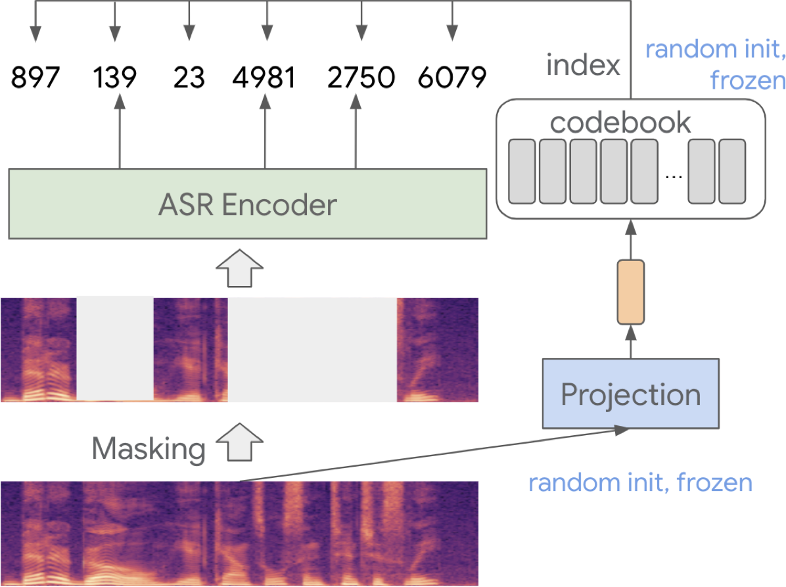

</img>

## BEST-RQ - Pytorch

Implementation of <a href="https://arxiv.org/abs/2202.01855">BEST-RQ</a> - a model for self-supervised learning of speech signals using a random projection quantizer, in Pytorch.

This model can be used to generate semantic tokens for e.g. <a href="https://github.com/lucidrains/spear-tts-pytorch">Spear-TTS</a> or <a href="https://github.com/lucidrains/soundstorm-pytorch">SoundStorm</a>.

## Appreciation

- <a href="https://github.com/lucidrains">Phil Wang</a> for the RVQ and Conformer implementations and constant support & guidance!

## Install

```bash
$ pip install best-rq-pytorch
```

## Usage

Pretrain a BEST-RQ model from audio-only data:

```python
import torch

from best_rq_pytorch import (
    ConformerWrapper
    BestRQ,
    BestRQPretrainer
)

brq = BestRQ(
    codebook_size = 1024,
    codebook_dim = 16,
    sample_rate = 24_000,
    n_mels = 80,
    win_length = 960,
    hop_length = 960 // 3,  # generate labels at 75Hz
    conformer = ConformerWrapper(
        num_tokens = 1024,
        conformer = dict(
            dim = 1024,
            depth = 24,
            heads = 16,
            conv_kernel_size = 5
        )
    )
)

trainer = BestRQPretrainer(
    model = brq,
    dataset = ...,
    num_train_steps = 1_000_000,
    lr = 5e-4,
    num_warmup_steps = 32_000,
    initial_lr = 1e-5,
    batch_size = 8,
    grad_accum_every = 2,
    mask_prob = 0.6
)

trainer.train()

```

See the examples folder for additional uses, such as fitting a k-means quantizer to the activations of a specific layer of the pretrained model.

## Citations

```bibtex
@misc{chiu2022selfsupervised,
      title={Self-supervised Learning with Random-projection Quantizer for Speech Recognition}, 
      author={Chung-Cheng Chiu and James Qin and Yu Zhang and Jiahui Yu and Yonghui Wu},
      year={2022},
      eprint={2202.01855},
      archivePrefix={arXiv},
      primaryClass={cs.CL}
}
```


```bibtex
@misc{borsos2023soundstorm,
      title={SoundStorm: Efficient Parallel Audio Generation}, 
      author={Zalán Borsos and Matt Sharifi and Damien Vincent and Eugene Kharitonov and Neil Zeghidour and Marco Tagliasacchi},
      year={2023},
      eprint={2305.09636},
      archivePrefix={arXiv},
      primaryClass={cs.SD}
}
```
